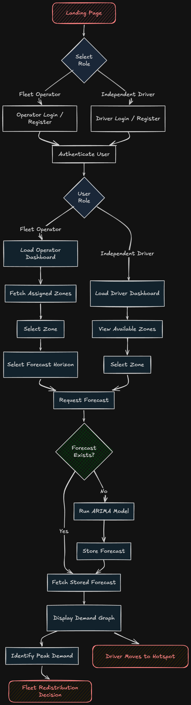

# 🚖 Taxi Zone-Wise Demand Forecasting System

## 📌 Overview

Urban transportation systems frequently experience spatial and temporal supply-demand imbalances. Drivers often operate without demand intelligence, leading to taxi oversupply in low-demand areas while passengers in other zones face long wait times. This results in revenue loss for fleet operators and higher operational costs for drivers.

This project builds a zone-level taxi demand forecasting platform using historical NYC taxi trip data. By applying time-series models (ARIMA/SARIMAX), the system predicts future pickup demand for individual zones on hourly and daily horizons, enabling data-driven fleet positioning decisions.

## 🎯 Problem Statement

*   Taxis cluster in low-demand areas.
*   High-demand zones suffer from taxi shortages.
*   Drivers lack predictive demand insights.
*   Fleet operators cannot strategically redistribute vehicles.

This system solves the problem by forecasting pickup demand per zone using historical data.

## 🧠 What We Forecast

**We forecast:**
*   📊 Number of taxi pickups per LocationID per hour/day.

**We do NOT forecast:**
*   Number of taxis in a zone
*   Supply levels
*   Driver positions

> Forecasts represent passenger demand, not taxi supply.

## 🏗 System Architecture

### 🖥 Frontend
*   React
*   Tailwind CSS
*   Recharts

### ⚙ Backend
*   FastAPI (Python)
*   REST API endpoints

### 🗄 Database
*   PostgreSQL
*   JSONB storage for forecasts

### 📊 ML / Analytics
*   Pandas
*   NumPy
*   statsmodels (ARIMA/SARIMAX)

## 🔄 How It Works

### 1️⃣ Data Processing
*   Load NYC Yellow Taxi Trip Records
*   Extract `tpep_pickup_datetime` and `PULocationID`
*   Aggregate pickup counts per zone per hour

### 2️⃣ Model Training
*   Train ARIMA/SARIMAX per `LocationID`
*   Generate hourly/daily demand forecasts
*   Store predictions in PostgreSQL

### 3️⃣ Forecast Retrieval
*   API checks if forecast exists & is fresh
*   If not, model runs and updates forecast
*   Dashboard displays historical vs predicted demand

## 👥 User Roles

### 🏢 Fleet Operator
*   Registers company account
*   Selects operating zones
*   Views assigned zone forecasts
*   Redistributes fleet strategically

### 🚗 Independent Driver
*   Registers as driver
*   Views zone demand forecasts
*   Moves to predicted high-demand zones

## 🗂 Database Schema (Core Tables)

### `zones`
*   `location_id`
*   `borough`
*   `zone_name`
*   `service_zone`

### `companies`
*   `id`
*   `name`
*   `email`
*   `password_hash`
*   `fleet_size`

### `company_zones`
*   `company_id`
*   `location_id`

### `forecasts`
*   `location_id`
*   `horizon`
*   `generated_at`
*   `forecast_values` (JSONB)

### 📊 Forecast Freshness Logic
*   Forecasts are timestamped.
*   If outdated (e.g., older than 24 hours), they are regenerated.
*   API returns stored forecasts for fast response.

## 🚀 Features

*   Zone-level demand forecasting
*   Hourly & daily forecast toggle
*   Historical vs predicted visualization
*   Role-based dashboards
*   Forecast caching & freshness validation
*   Multi-company open market model

## 📂 Dataset

**Data Source:**
*   NYC TLC Yellow Taxi Trip Records
*   Taxi Zone Lookup Table

**Required Columns:**
*   `tpep_pickup_datetime`
*   `PULocationID`

## 🔧 Installation (Example)

```bash
git clone https://github.com/yourusername/taxi-demand-forecasting.git
cd taxi-demand-forecasting
docker-compose up --build
```

## Consumer Flow



## 🎓 Academic Context

This project demonstrates:
*   Time-series forecasting
*   Multi-tenant SaaS architecture
*   Role-based access control
*   Demand prediction for urban mobility
*   End-to-end ML system design

## 📈 Future Improvements

*   Weather-integrated SARIMAX
*   Event-based spike detection
*   Reinforcement learning for fleet optimization
*   Real-time demand heatmaps
*   Supply-demand equilibrium modeling

## 📜 License

This project is developed for academic and research purposes.
