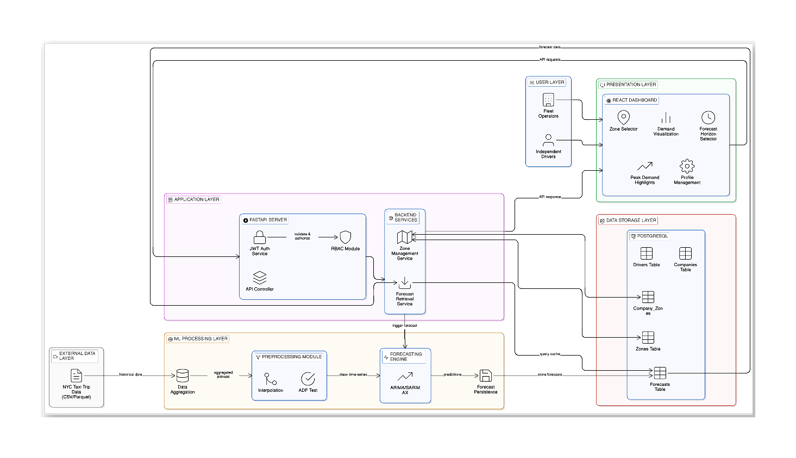
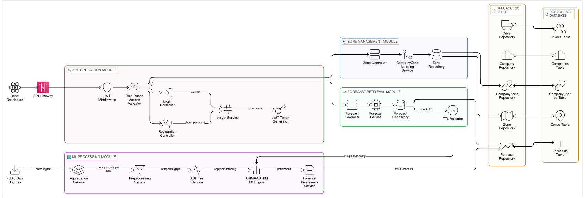

# 🚖 Taxi Zone-Wise Demand Forecasting System

## 📌 Overview

Urban transportation systems frequently experience spatial and temporal supply-demand imbalances. Drivers often operate without demand intelligence, leading to taxi oversupply in low-demand areas while passengers in other zones face long wait times. This results in revenue loss for fleet operators and higher operational costs for drivers.

This project builds a zone-level taxi demand forecasting platform using historical NYC taxi trip data. By applying time-series models (ARIMA/SARIMAX), the system predicts future pickup demand for individual zones on hourly and daily horizons, enabling data-driven fleet positioning decisions.

---

## 🎯 Problem Statement

*   **Taxis cluster in low-demand areas.**
*   **High-demand zones suffer from taxi shortages.**
*   **Drivers lack predictive demand insights.**
*   **Fleet operators cannot strategically redistribute vehicles.**

> This system solves the problem by forecasting pickup demand per zone using historical data.

---

## 🏗 System Architecture

### 🖥 Frontend
*   React
*   Tailwind CSS
*   Recharts

### ⚙ Backend
*   FastAPI (Python)
*   REST API endpoints

### 🗄 Database
*   PostgreSQL
*   JSONB storage for forecasts

### 📊 ML / Analytics
*   Pandas
*   NumPy
*   statsmodels (ARIMA/SARIMAX)

---

## 📐 High Level Design

The High-Level Design (HLD) of the system explains the interaction between different modules, from data ingestion to the presentation layer.

<p align="center">
  
</p>

### 1️⃣ User Layer
The system supports two types of users:
*   **Fleet Operators (Taxi Companies)**
*   **Independent Drivers**

These users interact with the system through a web-based dashboard to access zone-level demand forecasts and insights.

### 2️⃣ Presentation Layer (Frontend)
The frontend is developed using React.js and provides an interactive dashboard for users to:
*   Select operating zones
*   Choose forecast horizon (Hourly / Daily)
*   View historical demand vs predicted demand
*   Identify peak demand intervals
*   Manage user profile

This layer sends user requests to the backend via REST APIs.

### 3️⃣ Application Layer (Backend)
The backend is implemented using FastAPI and is responsible for:
*   Handling API requests
*   User authentication using JWT
*   Role-based access control (Fleet Operator / Driver)
*   Zone management
*   Forecast retrieval

The backend also validates forecast freshness before serving predictions.

### 4️⃣ ML Processing Layer
This layer performs data processing and forecasting tasks, including:
*   Aggregation of taxi pickup data per zone and time interval
*   Time-series preprocessing such as interpolation
*   Stationarity testing using ADF Test
*   Forecast generation using ARIMA/SARIMAX models

This module is triggered when a forecast is unavailable or expired.

### 5️⃣ Data Storage Layer
The system uses PostgreSQL to store:
*   Company information
*   Driver details
*   Taxi zone data
*   Company-zone mappings
*   Forecast results

Forecasts are stored with timestamps to enable caching and freshness validation.

### 6️⃣ External Data Source Layer
The system uses publicly available NYC Taxi Trip historical datasets as an external data source for training forecasting models and generating zone-wise demand predictions.

### 7️⃣ Data Flow
The overall system workflow is as follows:
> **User** → **React Dashboard** → **FastAPI Backend** → **Forecast Service** → **ARIMA Model** → **PostgreSQL Database** → **API Response** → **Dashboard Visualization**

### 8️⃣ Forecast Caching Mechanism
To reduce latency and improve performance:
*   Generated forecasts are stored in the database.
*   Forecasts are served from storage if they are still valid.
*   If expired, the forecasting engine is triggered to generate updated predictions.

### 9️⃣ Scalability Consideration
The system is designed with containerization support using Docker, enabling future horizontal scaling of backend services if required.

---

## 🧩 Low Level Design

The Low-Level Design (LLD) details the internal component structure and relationships within the system.

<p align="center">
  
</p>

### 1️⃣ Authentication Module
This module is responsible for validating users before granting access to the system.
*   Handles user login and registration requests
*   Verifies credentials using bcrypt password hashing
*   Generates JWT token upon successful login
*   Uses JWT Middleware to validate incoming API requests
*   Applies Role-Based Access Control (Fleet Operator / Driver)

### 2️⃣ Zone Management Module
This module manages the assignment of operating zones to companies.
*   Fetches assigned zones for fleet operators
*   Updates company operating zones
*   Validates zone existence
*   Maintains mapping between companies and zones
*   Interacts with Zone Repository and Company_Zones table

### 3️⃣ Forecast Retrieval Module
This module handles user requests for demand forecasts.
*   Accepts forecast request for selected zone
*   Queries Forecast Repository
*   Validates forecast freshness using TTL logic
*   Returns stored forecast if valid
*   Triggers ML module if forecast is missing or expired

### 4️⃣ ML Processing Module
This module generates demand forecasts when required.
*   Aggregates pickup counts per zone and time interval
*   Performs time-series preprocessing:
    *   Interpolation of missing data
    *   Stationarity testing using ADF test
    *   Differencing if required
*   Applies ARIMA/SARIMAX forecasting model
*   Generates zone-level demand predictions

### 5️⃣ Forecast Persistence Service
This component stores predicted demand values.
*   Saves forecast data in Forecasts table
*   Stores forecast generation timestamp
*   Enables caching for faster future retrieval

### 6️⃣ Data Access Layer
This layer manages database interaction.
*   **Includes**:
    *   Company Repository
    *   Driver Repository
    *   Zone Repository
    *   CompanyZone Repository
    *   Forecast Repository
*   **Operations**:
    *   These repositories perform CRUD operations on:
        *   Companies Table
        *   Drivers Table
        *   Zones Table
        *   Company_Zones Table
        *   Forecasts Table

### 7️⃣ Forecast Expiry (TTL) Logic
Ensures forecast freshness and consistency.
*   Checks `generated_at` timestamp
*   Determines forecast validity period
*   Regenerates forecast if expired
*   Reduces unnecessary model recomputation

### 8️⃣ API Request Lifecycle
System processes requests as follows:
> **React Dashboard** → **API Gateway** → **JWT Middleware** → **Role Validation** → **Forecast Controller** → **Forecast Service** → **Forecast Repository** → **ML Processing Module** (if needed) → **PostgreSQL Database** → **API Response**

### 9️⃣ External Data Source Integration
*   Public NYC Taxi Trip Dataset used for demand aggregation
*   Batch ingestion performed before forecasting
*   Serves as input for time-series model training

### 🔟 Security Consideration
*   JWT-based authentication
*   Password hashing using bcrypt
*   Role-based access control
*   Zone-level data access restriction

---

## 🔄 How It Works

### 1️⃣ Data Processing
*   Load NYC Yellow Taxi Trip Records
*   Extract `tpep_pickup_datetime` and `PULocationID`
*   Aggregate pickup counts per zone per hour

### 2️⃣ Model Training
*   Train ARIMA/SARIMAX per `LocationID`
*   Generate hourly/daily demand forecasts
*   Store predictions in PostgreSQL

### 3️⃣ Forecast Retrieval
*   API checks if forecast exists & is fresh
*   If not, model runs and updates forecast
*   Dashboard displays historical vs predicted demand

---

## 👥 User Roles

### 🏢 Fleet Operator
*   Registers company account
*   Selects operating zones
*   Views assigned zone forecasts
*   Redistributes fleet strategically

### 🚗 Independent Driver
*   Registers as driver
*   Views zone demand forecasts
*   Moves to predicted high-demand zones

---

## 🗂 Database Schema (Core Tables)

### 1️⃣ Zones Entity
| Attribute | Data Type | Key |
| :--- | :--- | :--- |
| `location_id` | INT | Primary Key |
| `borough` | VARCHAR | |
| `zone_name` | VARCHAR | |
| `service_zone` | VARCHAR | |

### 2️⃣ Companies Entity
| Attribute | Data Type | Key |
| :--- | :--- | :--- |
| `id` | INT | Primary Key |
| `name` | VARCHAR | |
| `email` | VARCHAR | Unique |
| `password_hash` | TEXT | |
| `fleet_size` | INT | |

### 3️⃣ Drivers Entity
| Attribute | Data Type | Key |
| :--- | :--- | :--- |
| `id` | INT | Primary Key |
| `name` | VARCHAR | |
| `email` | VARCHAR | Unique |
| `password_hash` | TEXT | |

### 4️⃣ Company_Zones Entity
| Attribute | Data Type | Key |
| :--- | :--- | :--- |
| `id` | INT | Primary Key |
| `company_id` | INT | Foreign Key |
| `location_id` | INT | Foreign Key |

> **Constraint:** `UNIQUE(company_id, location_id)`

### 5️⃣ Forecasts Entity
| Attribute | Data Type | Key |
| :--- | :--- | :--- |
| `id` | INT | Primary Key |
| `location_id` | INT | Foreign Key |
| `horizon` | VARCHAR | |
| `generated_at` | TIMESTAMP | |
| `forecast_values` | JSONB | |

### 📊 Forecast Freshness Logic
*   Forecasts are timestamped.
*   If outdated (e.g., older than 24 hours), they are regenerated.
*   API returns stored forecasts for fast response.

---

## 🚀 Features

*   **Zone-level demand forecasting**
*   **Hourly & daily forecast toggle**
*   **Historical vs predicted visualization**
*   **Role-based dashboards**
*   **Forecast caching & freshness validation**
*   **Multi-company open market model**

---

## 📂 Dataset

**Data Source:**
*   NYC TLC Yellow Taxi Trip Records
*   Taxi Zone Lookup Table

**Required Columns:**
*   `tpep_pickup_datetime`
*   `PULocationID`

---

## 🔧 Installation (Example)

```bash
git clone https://github.com/yourusername/taxi-demand-forecasting.git
cd taxi-demand-forecasting
docker-compose up --build
```

---

## Consumer Flow

<p align="center">
  
</p>


## 🎓 Academic Context

This project demonstrates:
*   Time-series forecasting
*   Multi-tenant SaaS architecture
*   Role-based access control
*   Demand prediction for urban mobility
*   End-to-end ML system design

---

## 📈 Future Improvements

*   Weather-integrated SARIMAX
*   Event-based spike detection
*   Reinforcement learning for fleet optimization
*   Real-time demand heatmaps
*   Supply-demand equilibrium modeling

---

## 📜 License

This project is developed for academic and research purposes.
